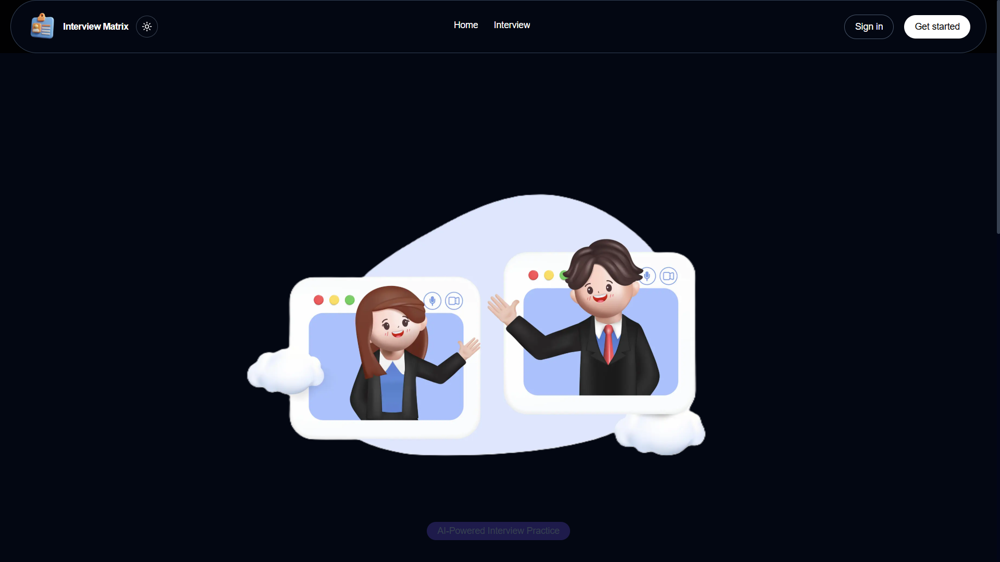
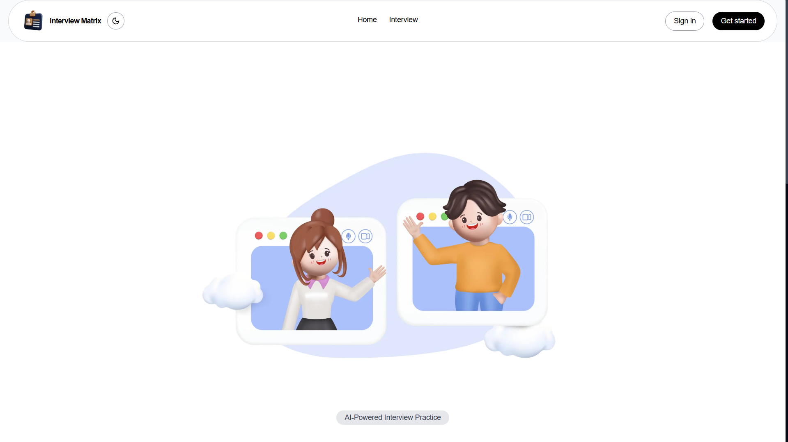

# 🎯 Interview Matrix — AI-Powered Interview Preparation Platform

A full-stack platform for technical interview practice with **real-time facial emotion detection**, **voice analysis**, **NLP answer scoring**, and **resume-based question generation**.

---

# Screenshot 

  

## 🏗️ Tech Stack

| Layer | Technology |
|---|---|
| Frontend | Next.js 14, Tailwind CSS, Recharts, Socket.IO client |
| Backend | Node.js, Express.js, Socket.IO, Mongoose |
| Database | MongoDB |
| ML Service | Python, Flask, DeepFace, SpeechRecognition, sentence-transformers |
| AI Questions | OpenAI GPT-4o-mini |

---

## 📁 Project Structure

```
interview-platform/
├── frontend/          # Next.js app (port 3000)
│   └── src/
│       ├── app/
│       │   ├───globals.css
│       │   ├───layout.jsx
│       │   ├───not-found.jsx
│       │   ├───page.jsx  
│       │   ├───(admin)
│       │   │   └───admin
│       │   │       ├───layout.jsx  
│       │   │       ├───page.jsx  
│       │   │       ├───profiles/page.jsx       
│       │   │       ├───questions/page.jsx      
│       │   │       └───reports/page.jsx                             
│       │   ├───(protected)/layout.jsx  
│       │   │   ├───dashboard/page.jsx       
│       │   │   ├───interview/page.jsx   
│       │   │   │   └───[sessionId]/page.jsx           
│       │   │   ├───profile/page.jsx     
│       │   │   ├───results/page.jsx
│       │   │   │   └───[sessionId]          
│       │   │   └───upload/page.jsx         
│       │   ├───login/page.jsx      
│       │   └───register/page.jsx         
│       ├───components
│       │   ├───AIInterviewerPanel.jsx
│       │   ├───ConfidenceScore.jsx
│       │   ├───customToast.js
│       │   ├───EmotionDetector.jsx
│       │   ├───footer.jsx
│       │   ├───FullPageLoader.jsx
│       │   ├───LayoutWraper.jsx
│       │   ├───Navbar.jsx
│       │   ├───OAuthButton.jsx
│       │   ├───ProtectedRoute.jsx
│       │   ├───PublicRoute.jsx
│       │   ├───VoiceRecorder.jsx
│       │   ├───auth
│       │   │     ├───login_form.js
│       │   │     ├───protected-route.js
│       │   │     └───register-form.js    
│       │   ├───profile
│       │   │     └───profile-view.js    
│       │   └───ui....
│       └───lib
│            ├───api.js
│            ├─── authContext.js
│            └───utils.js                   
│
├── backend/           # Express.js API (port 5000)
│   ├── controllers/
│   │   ├── admin.controller.js
│   │   ├── auth.controller.js
│   │   ├── evaluation.controller.js
│   │   ├── interview.controller.js
│   │   ├── profile.controller.js
│   │   ├── .controller.js
│   │   └── resume.controller.js        
│   ├── middleware/
│   │   └──auth.js        
│   ├── models/        # Mongoose models
│   │   ├── User.js
│   │   ├── Resume.js
│   │   ├── Question.js
│   │   └── Session.js
│   ├── routes/
│   │   ├── admin.routes.js
│   │   ├── auth.routes.js
│   │   ├── evaluation.routes.js
│   │   ├── interview.routes.js
│   │   ├── profile.routes.js
│   │   ├── questions.routes.js
│   │   └── resume.routes.js
│   ├── utils/
│   │   ├── resumeParser.js
│   │   ├──makeAdmin.js
│   │   ├──passport.js
│   │   ├──password.js  
│   │   └── aiHelper.js      # GEMINI  feedback
│   ├── seed/
│   │   └── questions.js     # 50+ starter questions
│   └── server.js
│
└── ml-service/        # Flask ML API (port 8000)
    └── app.py         # Emotion, voice, NLP endpoints
```

---

## 🚀 Quick Start (Local Development)

### Prerequisites
- Node.js 18+
- Python 3.10+
- MongoDB (local or Atlas)

### 1. Clone & Install Backend
```bash
cd backend
cp .env.example .env
# Edit .env — add your MONGODB_URI and OPENAI_API_KEY
npm install
npm run dev
```

### 2. Install & Run ML Service
```bash
cd ml-service
python -m venv .venv
source venv/bin/activate  # Windows: venv\Scripts\activate
pip install -r requirements.txt
python -m spacy download en_core_web_sm
python app.py
```

### 3. Install & Run Frontend
```bash
cd frontend
cp .env.example .env.local
npm install
npm run dev
```

### 4. Seed the database with starter questions
```bash
cd backend
node seed/questions.js
```

Open **http://localhost:3000** 🎉

---

## 🐳 Docker (One Command)

```bash
# Copy and fill env vars first
cp backend/.env.example backend/.env
# Add  to backend/.env

docker-compose up --build
```

---

## 🔑 API Endpoints

### Auth
| Method | Endpoint | Description |
|---|---|---|
| POST | `/api/auth/register` | Register user |
| POST | `/api/auth/login` | Login → JWT |
| GET | `/api/auth/me` | Get current user |
|| POST | `/api/auth/google` | Login → Oauth |

### Resume
| Method | Endpoint | Description |
|---|---|---|
| POST | `/api/resume/upload` | Upload PDF/DOCX → tech detection |
| GET | `/api/resume/my` | List user's resumes |

### Interview
| Method | Endpoint | Description |
|---|---|---|
| POST | `/api/interview/start` | Start session, get questions |
| POST | `/api/interview/:id/answer` | Submit answer + emotion/voice data |
| POST | `/api/interview/:id/complete` | Finalize session |
| GET | `/api/interview/sessions` | Session history |

### Evaluation
| Method | Endpoint | Description |
|---|---|---|
| POST | `/api/evaluation/emotion` | Analyze webcam frame → emotion |
| POST | `/api/evaluation/voice` | Analyze audio → metrics |
| GET | `/api/evaluation/session/:id/report` | Full confidence report |

### ML Service (Flask)
| Method | Endpoint | Description |
|---|---|---|
| POST | `/analyze_emotion` | DeepFace emotion from base64 frame |
| POST | `/analyze_voice` | Speech recognition + metrics |
| POST | `/analyze_answer` | Semantic NLP scoring |
| POST | `/confidence_score` | Weighted confidence aggregation |

---

## 🧠 Confidence Score Formula

```
Confidence = (emotion × 0.30) + (voice_clarity × 0.20) + (nlp_score × 0.50)
```

### Emotion → Confidence mapping
| Emotion | Confidence contribution |
|---|---|
| Happy | 90% |
| Neutral | 70% |
| Surprise | 65% |
| Sad | 40% |
| Fear | 35% |
| Angry | 30% |

---

## 🔧 Tech Stack Detection from Resume

The resume parser scans text for keywords and assigns categories:

| Category detected | Keywords matched |
|---|---|
| `frontend` | react, vue, angular, tailwind, typescript |
| `backend` | express, django, flask, fastapi, rest api |
| `mern` | mongodb + express + react + node (all 4) |
| `fullstack` | full stack, mern, mean |
| `python` | python, django, pandas, tensorflow |
| `html` | html, html5, css, css3 |
| `system_design` | microservices, scalability, load balancer |

---

## 📦 Dependencies Summary


### Backend
- `express` — HTTP server
- `mongoose` — MongoDB ODM
- `jsonwebtoken` — Auth tokens
- `multer` — File upload
- `pdf-parse` + `mammoth` — Resume text extraction
- `socket.io` — Real-time emotion streaming
- `openai` — Question generation + feedback

### ML Service
- `deepface` — Facial emotion detection
- `speechrecognition` — STT from audio
- `sentence-transformers` — Semantic NLP scoring
- `pydub` — Audio processing
- `flask` + `flask-cors` — API server

### Frontend
- `next.js` 14 — React framework
- `tailwindcss` — Utility CSS
- `react-webcam` — Camera capture
- `react-dropzone` — File upload UI
- `recharts` — Results charts
- `socket.io-client` — Live emotion updates
- `react-hot-toast` — Notifications

---

## 🛠️ Extending the Platform

### Add more questions
Edit `backend/seed/questions.js` and re-run the seeder.

### Add a new tech category
1. Add keywords to `TECH_KEYWORDS` in `backend/utils/resumeParser.js`
2. Add the new enum value to the `Question` model's `category` field
3. Add badge color in `frontend/src/app/upload/page.jsx`'s `TECH_COLORS`

### Improve emotion accuracy
Replace `DeepFace` in `ml-service/app.py` with `FER` library or a custom TensorFlow model trained on interview datasets.
